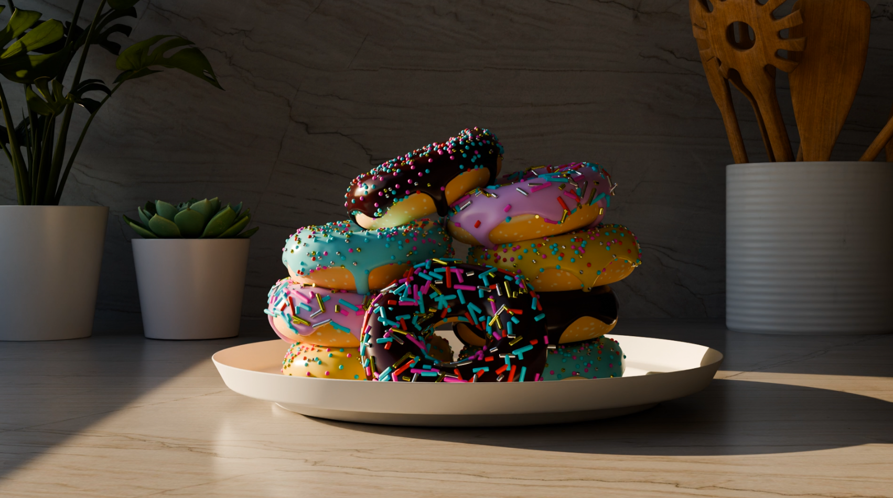

# Blender
🎨 A collection of my Blender projects including modeling, animation, and simulation scenes. Showcasing creativity, lighting, and rendering techniques as I explore 3D design.

# Blender Projects by Praveen Jadhav

Welcome! This repository contains two beginner-to-intermediate level Blender projects I've worked on: the classic Donut Scene and a Cinematic Ocean Scene. Both showcase different aspects of 3D design, modeling, lighting, and animation.

---

## 📌 Project 1: 🍩 Donut Scene

### 🔧 Tools Used:
- Blender (Modeling, Texturing, Lighting)
- Cycles Renderer
- Basic UV Mapping

### 📝 Description:
This is my first Blender project, inspired by Blender Guru’s famous tutorial. It features a realistic donut with icing, a plate, and a simple studio lighting setup.

### 📸 Preview: 🍩 Donut Scene

  
**▶️ Click the image to watch the animation**
---

## 🌊 Project 2: Cinematic Ocean Scene

### 🔧 Tools Used:
- Ocean Modifier
- Environment Lighting (Sun lamp & HDRi)
- Camera Animation
- Fog & Color Grading

### 📝 Description:
This scene is a calm cinematic ocean created using the ocean modifier. It simulates realistic wave movement, with subtle fog and lighting to enhance the mood.

### 🎥 Preview: 🌊 Ocean Scene 

**▶️ Click the image to watch the animation**
---

## 🔗 Links
- 🔗 [View all project files on Google Drive](https://drive.google.com/drive/folders/1GGG_oHa0zNmiY5Y-_lnSyzW1bmbfgayR?usp=sharing)

- Portfolio Website (Coming soon)

---

## 👤 Author
**Praveen Jadhav**  
BCA Student, RLSBCA College  
GitHub: [@praveenjadhav1510](https://github.com/praveenjadhav1510)
